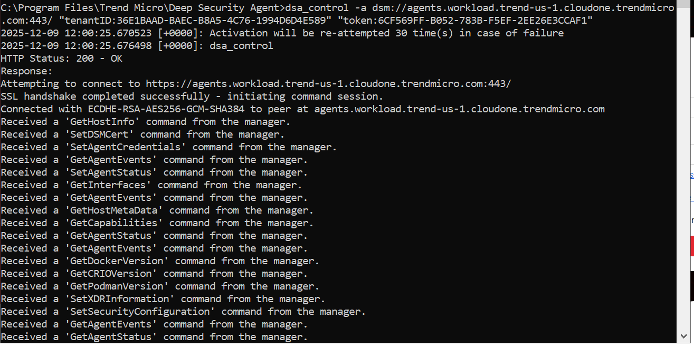
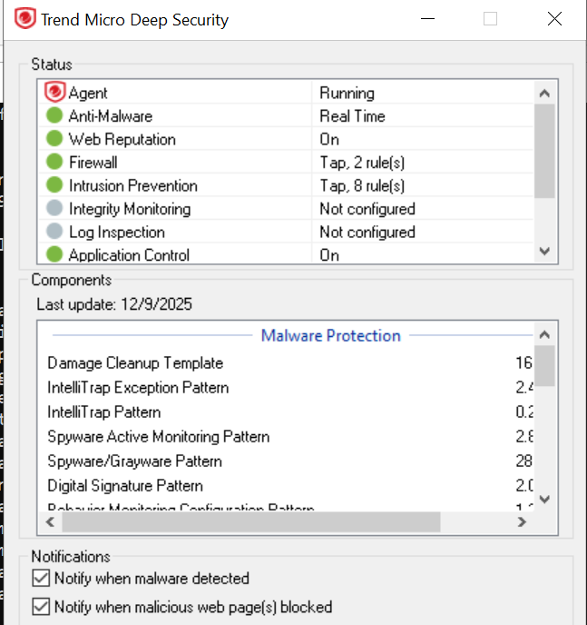
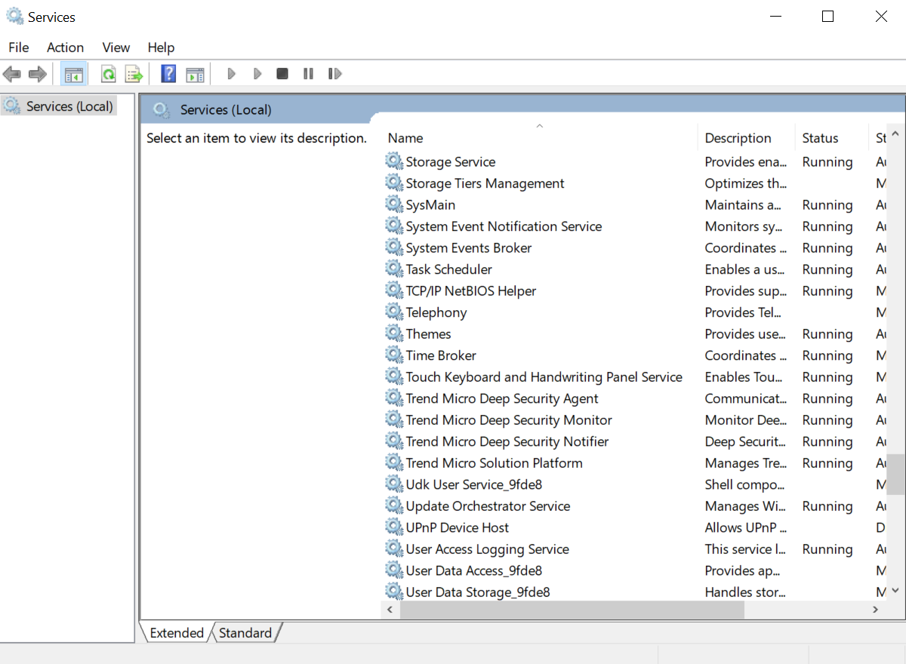
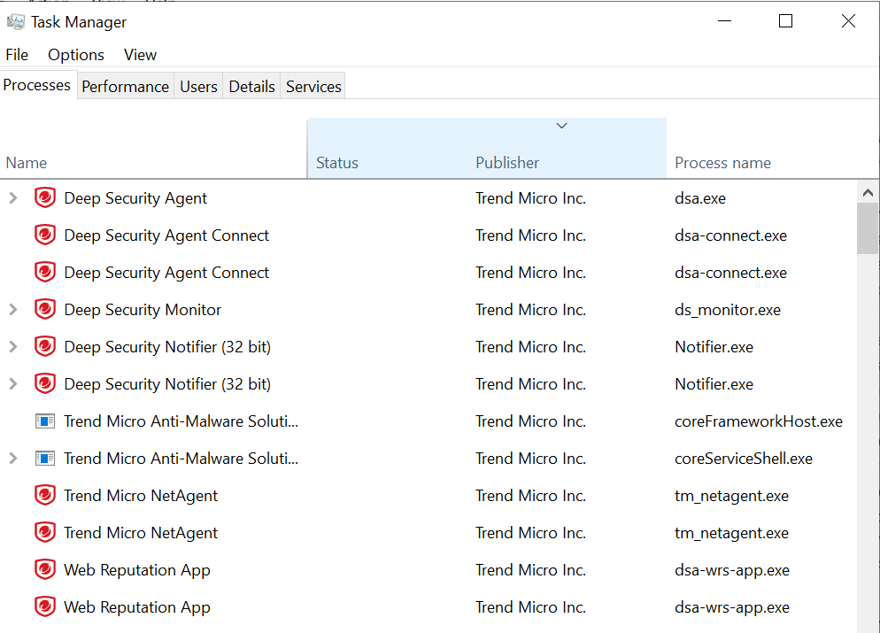

 # LAB 1 - Workload
 
## Pre-requisites
Network Diagram

1. VPC

2. Subnets

3. Internet (Public) and NAT Gateways (Private)

    `IGW`

    

    `NAT`

    

## Requirements
1. Create two policies - one for Windows and one for Linux

    a. Enable all the Agent features on the policy
    
    `Windows`
    

    `Linux`
    

    b. Set the network engine to Tap mode

    `Windows`

    

    `Linux`

    

2. Install Deep Security Agent (DSA) on the Windows and Linux instances in the public subnet using the deployment script then assign the policy created in Step 1.
    
    `Web Console`

    

    `Windows`

    

    `Linux`

    

    **Note:** In Linux, there's a Software Update on *Device Control*, DC is not compatible with this specific OS. Compatible with MAC OS and other...
     
3. Using the MSI installer, install and activate the Deep Security Agent in your Windows Server in the private subnet then assign the policy created.

    `Windows Agent for 64bit`

    

    `MSI Installer`

    
    
    `MSI Agent Setup`

    
    
    `Activation Req`

    
    
    `Activation CLI`

    

    `Win Server 2022 Private`

    

    **Note**: dsa_control -a dsm://host:port/ "tenantID""token"

    WHERE: 
    1. Host - dsm://agents.workload.trend-us-1.cloudone.trendmicro.com
    2. Port -443/ 
    3. TenantID - "tenantID:36E1BAAD-BAEC-B8A5-4C76-1994D6D4E589" 
    4. Token - "token:6CF569FF-B052-783B-F5EF-2EE26E3CCAF1"

4. Identify the services, processes and drivers associated with the Deep Security Agent.

    **Windows**

    `Services.msc`

    

    `Task manager`

    

    `Drivers`

    

    **Linux**
    
    `ps aux | grep ds_agent`

    

    `lsmod`

    

5. Create a report to show all computer status monthly. 

    
    

    **Note**: Located in Events&Reports -> Generate Reports -> Scheduled Reports -> New

6. Update the schedule for Daily Check for Security Update.

    

    **Note**: Located in Administration -> Scheduled Tasks -> New

7. Generate diagnostic logs for the Agent.

    `Win Server 2022`

    
    
    
    `Linux`

    
    

    **Note**: Located in Computers -> Double Click a Computer -> Overview -> Actions -> Create a Diagnostic Package

8. Understand the concept of the Fast heartbeat >> Fast agent-initiated heartbeats architecture

    **Regular heartbeat** (10mins) provides the foundation for agent-manager communication on a scheduled basis, while **fast heartbeat** adds the capability for immediate execution of specific operations