s# Web Proxy Integration

## Network Diagram

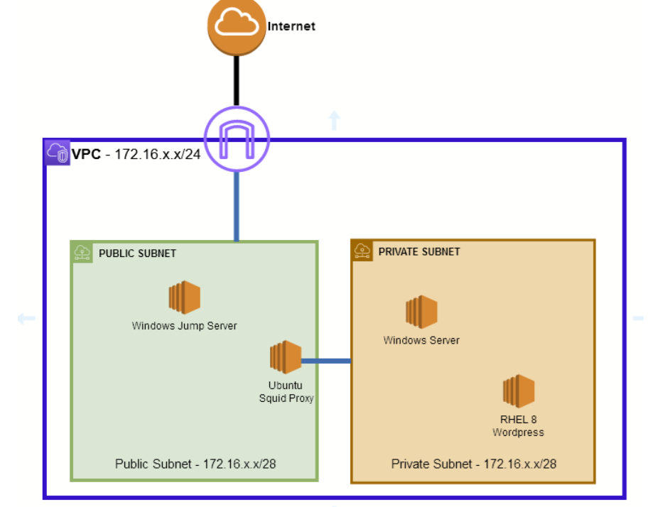

1. On your Ubuntu Server, Deploy a Squid Proxy

    Brief Explanation:
    
    `Squid` is a proxy caching server which provides proxy and cache services for `Hyper Text Transport Protocol (HTTP)`, `File Transfer Protocol (FTP)`, and other popular network protocols.

    - Acts as an intermediary between web servers and clients.
    - Fetches requested content from the web server and stores a local copy.
    - Serves cached content for repeated requests, reducing server load.
    - Improves performance and optimizes network bandwidth.
    - Can filter web traffic to enhance security.


    Using Ubuntu's documentation (https://documentation.ubuntu.com/server/how-to/web-services/install-a-squid-server/) on installing a Squid Server: 

    1. Install Squid

        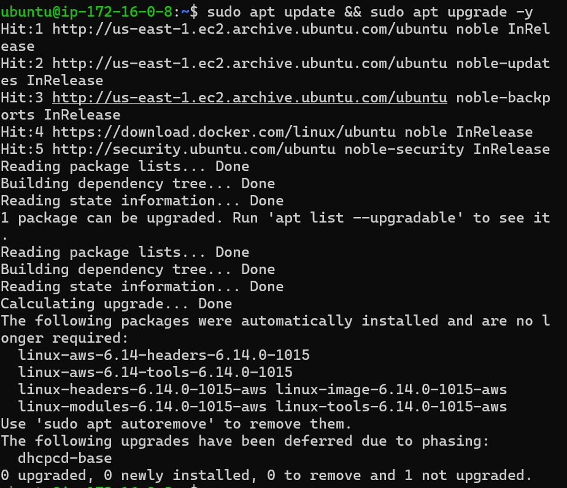
        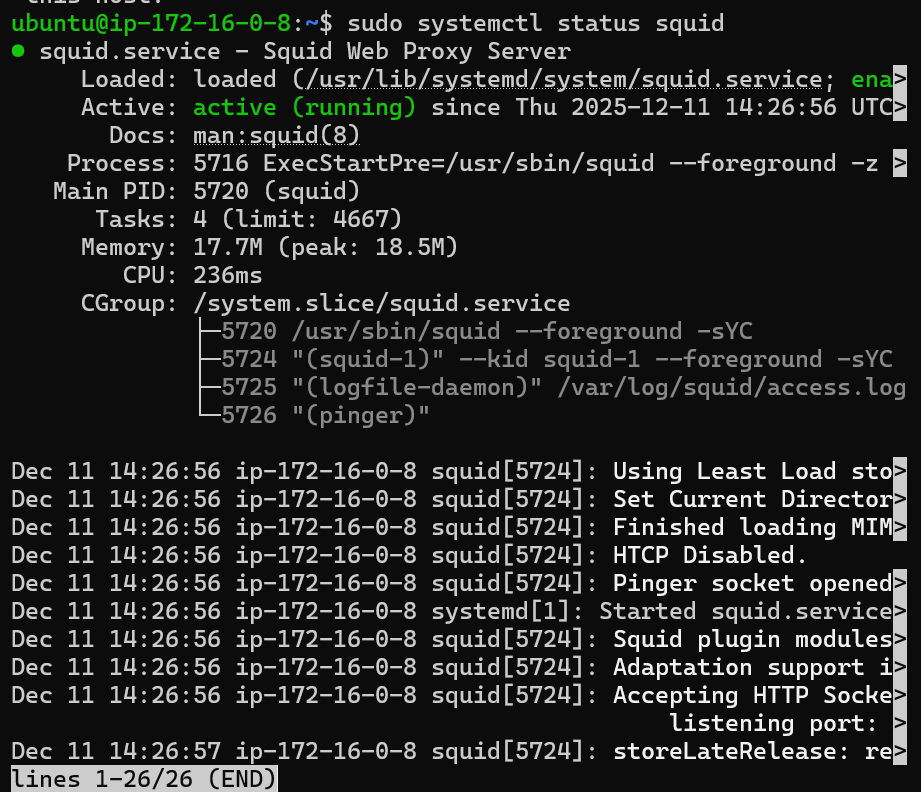

        Commands used:

        ```bash
        sudo apt update && sudo apt upgrade -y
        .
        sudo apt install squid
        .
        sudo systemctl status squid
        ```
    
    2. Configure Squid
    
        2.1 Protect the original config file

        **Note**: For best practice, before editing the configuration file, you should make a copy of the original and protect it from writing. You will then have the original settings as a reference, and can reuse it when needed.

        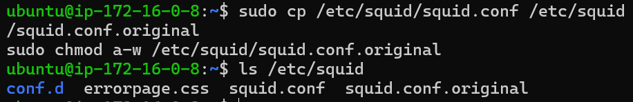

        Commands used:

        ```bash
        sudo cp /etc/squid/squid.conf /etc/squid/squid.conf.original
        .
        sudo chmod a-w /etc/squid/squid.conf.original
        .
        ls /etc/squid
        ```

        2.2 Change TCP port

        **Note**: To set your Squid server to listen on TCP port **8888** instead of the default TCP port 3128, change the http_port directive as such:

        `http_port 8888`

        However, on Cloud One Documentation, the default values for Squid HTTP proxy is 3128. Therefore, we don't need to change this.

        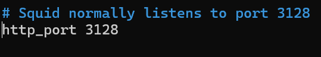

        2.3 Set hostname

        **Note**: Change the visible_hostname directive to give the Squid server a specific hostname. This hostname does not need to be the same as the computer’s hostname. By default, it automatically detects the system host name. Therefore, we don't need to change this.

        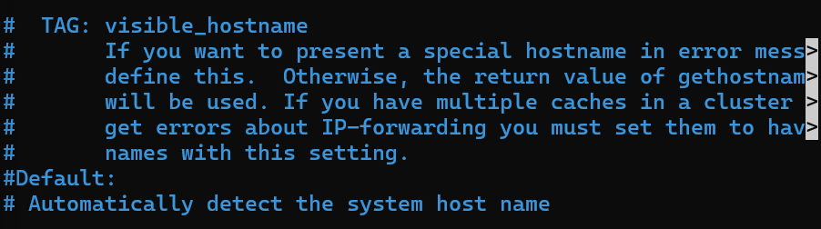

        2.4  Configure mem cache

        **Note**: The default setting is to use on-memory cache. This example tells squid to use up to 256MB of memory, erasing the last recently used content when the cache is full to free space for new items. We don't need to change this as well.

        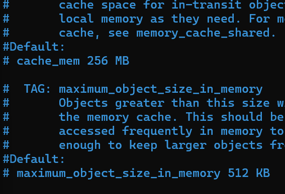

        **Note**: By default, for PoC, we don't need to modify the configuration and set it as the default config as it is. In addition, Squid can’t cache HTTPS because the traffic is encrypted.
    
    3. Access Control

        **Note**: Using Squid’s access control, you can configure use of Squid-proxied Internet services to be available only to users with certain Internet Protocol (IP) addresses. For PoC, we don't need to modify this, but if we want to illustriate access by users of the private subnet 172.16.0.16/28 subnetwork only, we can use this command:

        ```bash
        acl private_network src 172.16.0.16/28
        ```

        Then, add the following to the top of the http_access section of your /etc/squid/squid.conf file:

        ```bash
        http_access allow private_network
        ```

        **Note**: What this does is that it allows the .16 network to access HTTP protocol.

    4. Troubleshooting

        Squid version and status can be checked with:

        ```bash
        sudo squid -v
        sudo systemctl status squid
        ```

        For logs:

        ```bash
        sudo cat /var/log/squid/cache.log
        sudo cat /var/log/squid/access.log
        ```

        - Cache.log sample:
            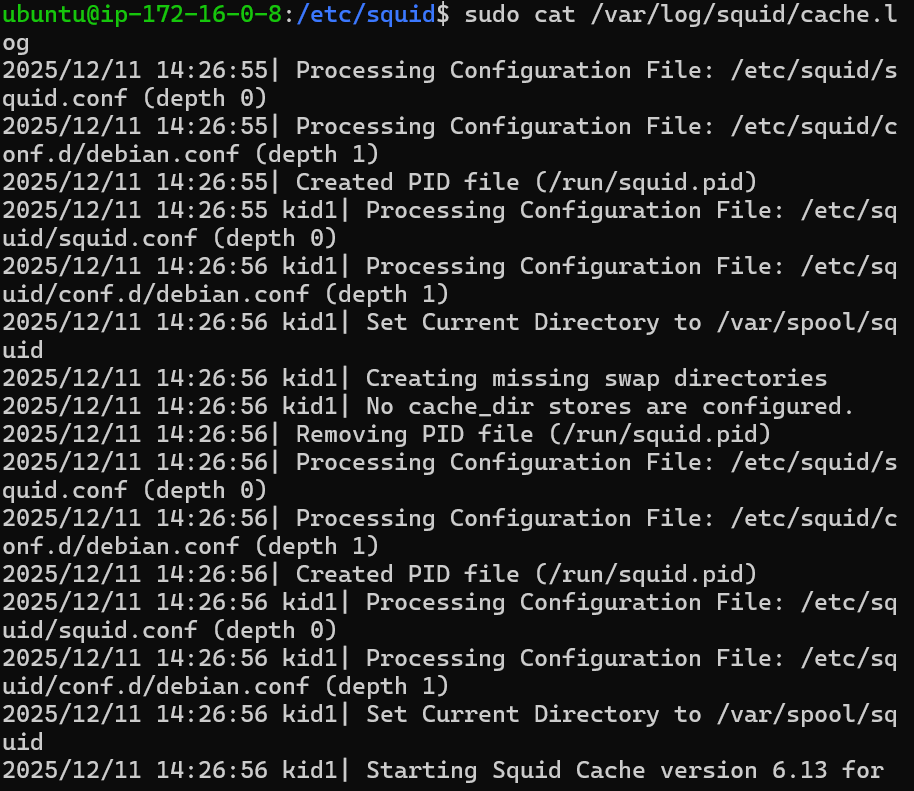

        For status summary:
        ```bash
        squidclient mgr:info
        ```

        **Note**: By default, `squidclient` is not downloaded.

1. Remove the NAT GW. The private subnet should use the proxy when connecting to external resources.

    Step 1: In AWS, go to the Ubuntu Instance, then press Actions -> Networking -> Change Source/Destination check -> Disable.

    `Example`
    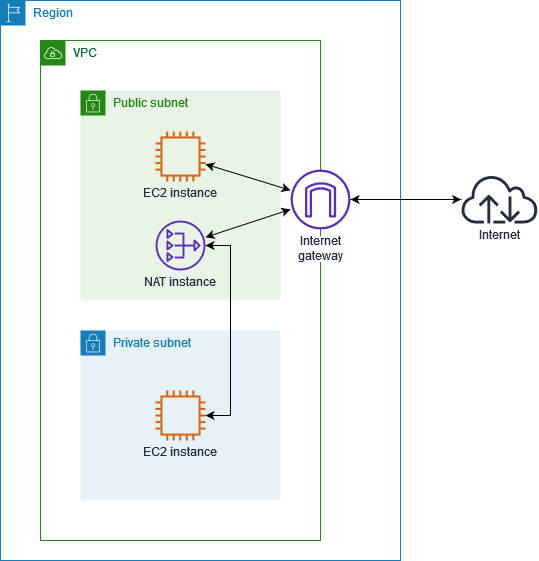

    **Note**: Each EC2 instance performs source/destination checks by default. This means that the instance must be the source or destination of any traffic it sends or receives. However, a NAT instance must be able to send and receive traffic when the source or destination is not itself. Therefore, you must disable source/destination checks on the NAT instance.

    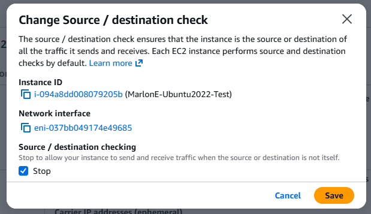

    Step 2: Enable IP Forwarding in Ubuntu. Use command:

    ```bash
    ubuntu@ip-172-16-0-8:~$ sysctl net.ipv4.ip_forward
    net.ipv4.ip_forward = 1
    ```

    **Note**: It returned `1`, therefore forwarding is enabled. If `0`, we can enable it temp using `sudo sysctl -w net.ipv4.ip_forward=1`

    Step 3: Configure NAT on Ubuntu. Enabling NAT for outbound traffic using this command:

    ```bash
    sudo iptables -t nat -A POSTROUTING -o enX0 -j MASQUERADE   
    sudo iptables -A FORWARD -o enX0 -m state --state RELATED,ESTABLISHED -j ACCEPT
    sudo iptables -A FORWARD -s 172.16.0.16/28 -j ACCEPT

    sudo apt-get install iptables-persistent
    ```

    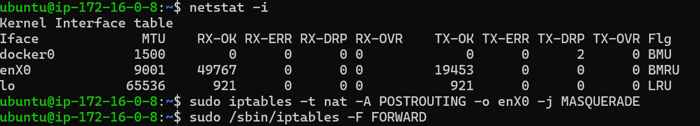

    **Note**: Basically, what this does is that it enable NAT for outbound traffic using public enX0 interface which dynamically use proxy's public IP. Then this allows forwarding between interfaces thru private subnet and internet. Installing the iptables-persistent so that the rules survive reboot.

     Step 4: Update AWS Route Table for Private Subnet -> we need to tell AWS to send all outbound traffic from the private subnet to the proxy instance.

     - Go to VPC - RT -> MarlonE-PrivateSubnet -> Edit Routes -> Selcet Network Interface (ENI) and choose the Ubuntu Proxy instance ENI

        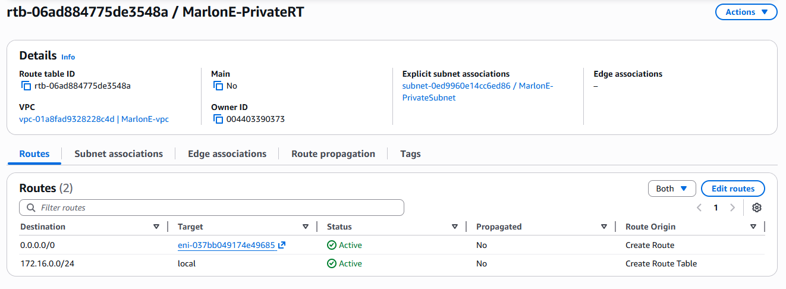

     **Note**: All traffic from the private subnet will go to the proxy instance, which will NAT it out to the Internet.

    Step 5: Security Groups & NACLs
    
    - Private Subnet Instance can Reach the Proxy Instance

        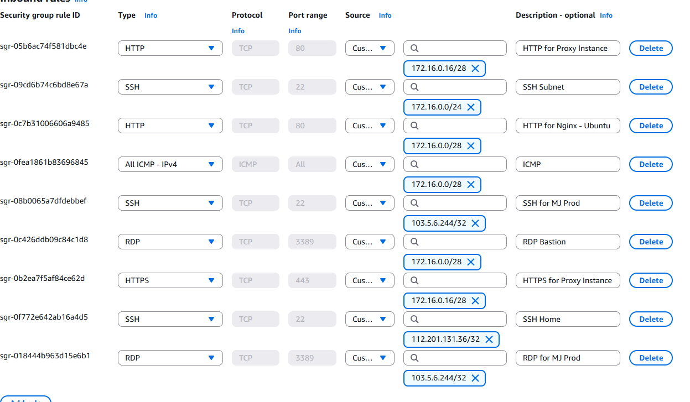

    **Note**: 172.16.0.16/28 for the Private Subnet reaching to HTTP and HTTPS for the Proxy Isntance.

    Step 6: Test from the Private Subnet if there's Internet Connection

    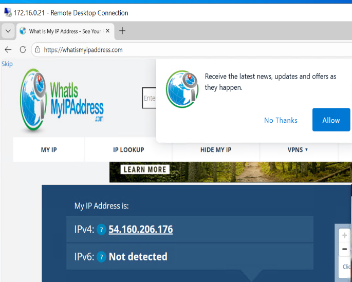

    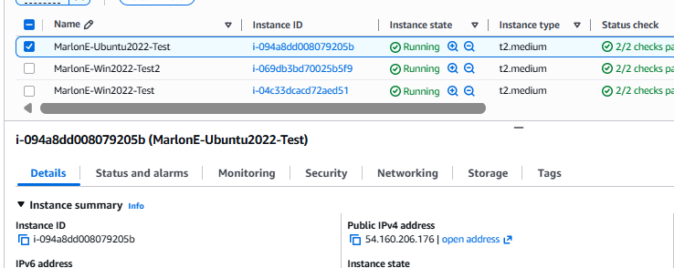

    **Note**: The first image is the Windows Server in the Private Subnet showing the public ip which was the Proxy server's public ip routing to the internet.

    Step 7: Change proxy settings

    -  Input IP address and port number of the proxy server: 
        - `172.16.0.8:3128`

        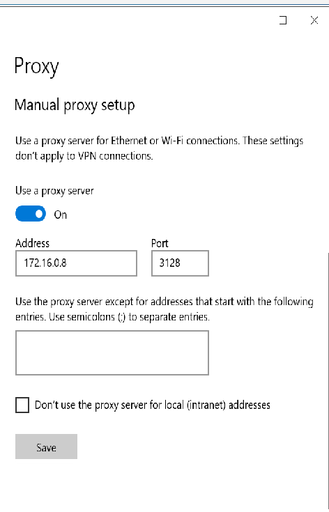

        `Accessing http://example.com`

        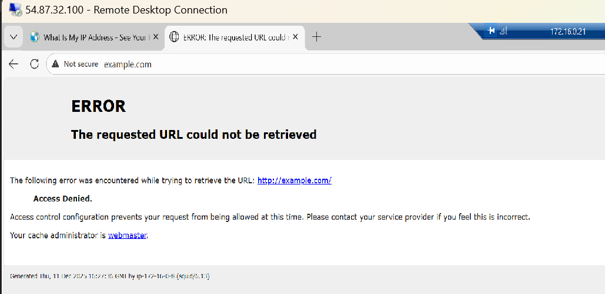

        `Accessing http://google.com`

        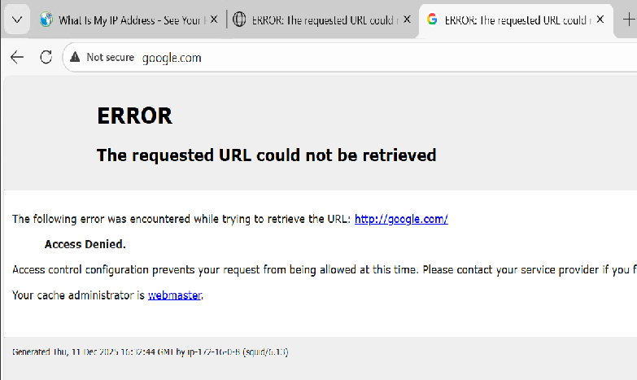

        `Checking the /var/log/squid/access.log`

        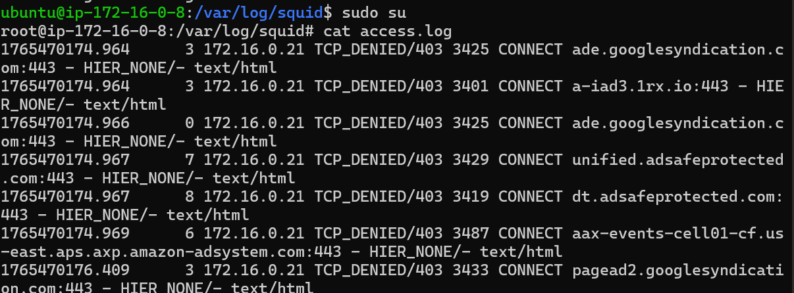

    **Note:** This is expected because as per Squid Proxy documentation, HTTPS is not supported unless it's configured. A way to access the `http://example.com` is to add an acl for the private subnet. In this case, we can use the command earlier:

    ```bash
    acl private_network src 172.16.0.16/28
    http_access allow private_network
    ```

    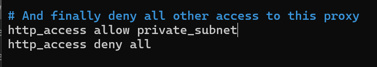
    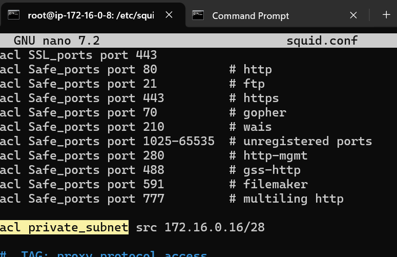

    Restart the service using `sudo systemctl restart squid`, try to access `http://example.com` again. Expected result should be working now. See image below.

    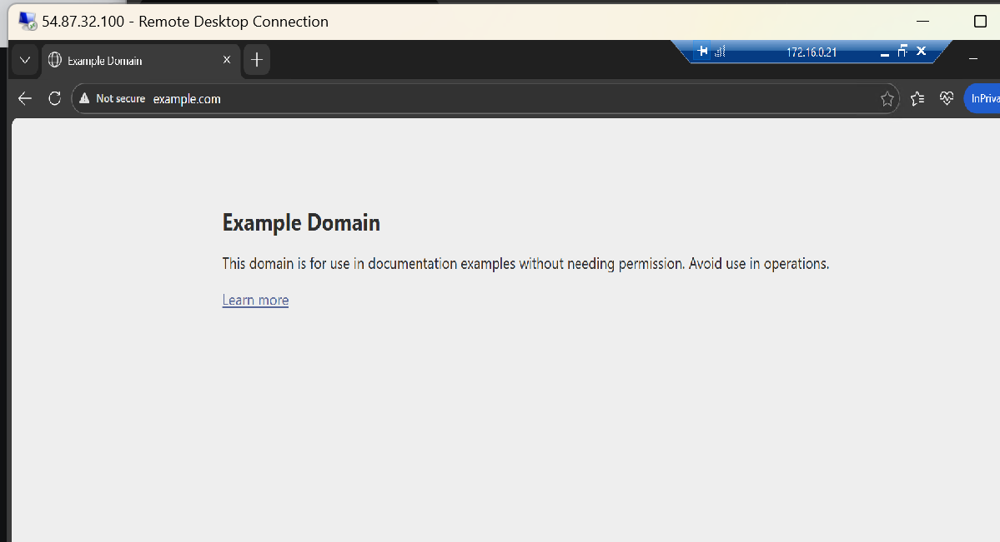

    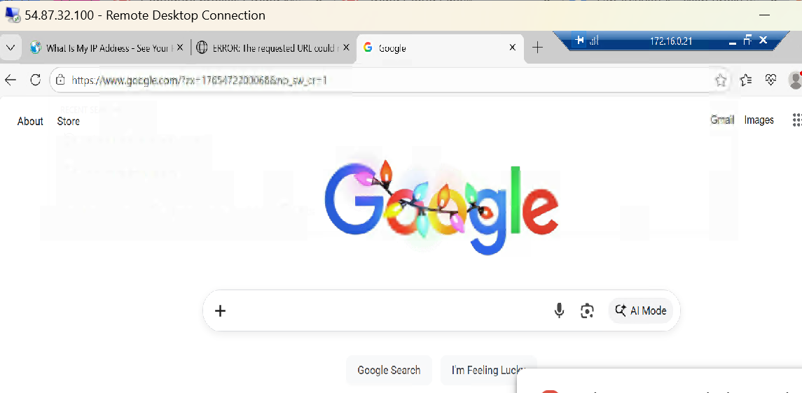

    `Checking access.log`

    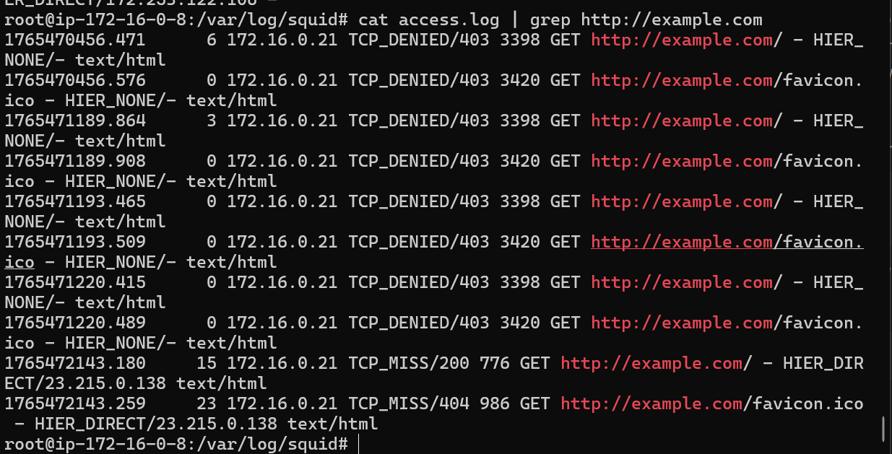

    Reference: https://docs.aws.amazon.com/vpc/latest/userguide/work-with-nat-instances.html#nat-routing-table

1. Deploy a DS Agent in the Wordpress Server (RHEL 8 with SQL Server 2022)

    - In AWS -> EC2 -> Launch Instance
        -  Name and Tags (Key:Value): 
            
            1. Name:MarlonE-RHEL-Test
            2. Shift:24x7-Shift

        - Application and OS Images
            
            1. RHEL 8.10 with SQL Server 2022 (64 bit x86)(ami-099b5eec69f378993) (2025-08-28)(ec2-user)
        
        - Instance Type

            1. t2.medium
        
        - Key pair

            1. MarlonE-KP

        - Network Settings

            1. MarlonE-vpc
            2. MarlonE-PrivateSubnet
            3. Auto-assign public IP
            4. MarlonE-SG

        - Storage

            1. 10 GiB gp3

        - Advanced Details

            1. User Data

                ```bash

                ```

# Workflow

`Step 1: Install and Configure Ubuntu Squid Proxy First.`

Step 2: Configure Proxies in Trend Micro Cloud One using Documentation (https://docs.trendmicro.com/en-us/documentation/article/trend-micro-cloud-one-workload-security-proxy-set-up)

Step 3: Deploy RHEL with WordPress Server then Connect both in Private Subnet to Proxy

Step 4: Use Wireshark to capture agents passing through proxy (In Ubuntu)

Step 5: Logs from Ubuntu Squid Proxy showing HB connection and logs from ds_agent.log


## Requirements

`1. Deploy the Squid Proxy in the your Ubuntu Server, and configure the EC2 instances in your private subnet to be able to access the internet. `

1. Deploy the DSA in the Wordpress Server after setting up the Proxy

1. Provide any additional steps required to complete the installation and activation of the Agent.

1. Show that the proxy is configured for DSA's deployed in the private subnet

1. Provide a packet capture to showcase the agents passing through the proxy.

1. Provide the log snippet from squid proxy logs, showing heartbeat connection of the agent.

1. From the ds_agent.log, show the lines related to Agent activation and heartbeat sequence behind a proxy.

## DELIVERABLES

1. Working Environment will be checked by the trainer

1. Document how did you configured/performed the tasks required in a pdf word file. Include the following information:

1. Step-by-step procedure for both deployment and configuration

1. Answers to the questions specified in this document (see “Command Line Activities” section)

1. Include any issues you have encountered in your document and how did you troubleshoot/resolve the issue.

**Tip**

`You can use the source IP address or the protocol used like HTTP as filter when tracing the packet capture`